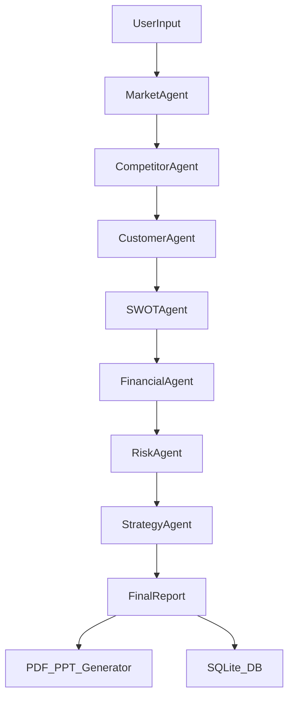

# 🚀 Agentic Business Strategy & Market Research System

**An Enterprise-Grade Multi-Agent System that acts as your virtual Chief Strategy Officer.**

This detailed AI system takes a simple business idea and autonomously performs deep market research, competitor analysis, financial estimation, and strategic planning using a swarm of 7 specialized AI agents.


---

## ✨ Key Features

-   **🤖 7 Specialized Agents**:
    1.  **Market Research Agent**: Analyzes market size, trends, and growth rates (TAM/SAM/SOM).
    2.  **Competitor Analysis Agent**: Identifies rivals, pricing models, and market gaps.
    3.  **Customer Insights Agent**: Creates personas and identifies pain points.
    4.  **SWOT Analysis Agent**: Synthesizes internal/external factors.
    5.  **Financial Estimation Agent**: Projects startup costs, OPEX, and revenue.
    6.  **Risk & Feasibility Agent**: Assesses legal, operational, and market risks.
    7.  **Chief Strategy Agent**: compiles the final verdict and execution roadmap.
-   **⚡ Multi-LLM Architecture**: Robust fallback system prioritizing **Groq (Llama 3)** for speed, with auto-failover to **Gemini Pro**, **Cohere**, and **Hugging Face**.
-   **🔍 Real-Time Web Search**: Uses `duckduckgo_search` (ddgs) for live, up-to-the-minute data scanning (No paid APIs required).
-   **🏢 Enterprise Dashboard**: Professional Dark Theme UI built with HTML/CSS/JS (Flask Backend).
-   **📥 Auto-Export**: Generates professional **PDF**, **PowerPoint (PPTX)**, and **Markdown** reports automatically.
-   **🗄️ History System**: SQLite database stores all past analyses for instant retrieval.

---

## 🛠️ Installation & Setup

### 1. Clone the Repository
```bash
git clone https://github.com/Ayush0135/business-analysis-agent.git
cd business-analysis-agent
```

### 2. Install Dependencies
Ensure you have Python 3.10+ installed.
```bash
pip install -r requirements.txt
```

### 3. Configure API Keys
Create a `.env` file in the root directory and add your free API keys. The system uses a waterfall approach—if one key is missing or fails, it skips to the next.

```env
# Primary (Fastest)
GROQ_API_KEY=gsk_...

# Secondary (Large Context)
GEMINI_API_KEY=AIza...

# Fallbacks (Optional)
COHERE_API_KEY=...
HF_TOKEN=...
```

---

## 🚀 Usage

### Start the Application
Run the Flask server:
```bash
python3 server.py
```

### Access the Dashboard
Open your browser and navigate to:
**`http://127.0.0.1:3000`**

1.  Enter your **Business Idea** (e.g., "AI Legal Assistant").
2.  Enter the **Industry** (e.g., "Legal Tech").
3.  Enter the **Target Region** (e.g., "USA").
4.  Click **"Generate Strategy"**.

The agents will start working in real-time, streaming their progress to the UI. Once finished, you can view the sections in tabs or download the full report.

---

## 🧩 System Architecture

The system uses a **Sequential Multi-Agent Workflow**:



Each agent performs specific web searches, gathers context, and passes its findings to the next agent to ensure a cohesive final strategy.

---

## 📂 Project Structure

```
├── agents/                 # Logic for individual AI agents
│   ├── market_research.py
│   ├── competitor_analysis.py
│   └── ...
├── static/                 # Frontend Assets
│   ├── style.css          # Enterprise Dark Theme
│   ├── script.js          # Logic for SSE & UI
│   └── reports/           # Generated PDF/PPTX storage
├── templates/
│   └── index.html         # Main Dashboard
├── utils/
│   ├── llm.py             # Multi-LLM Handler (Groq/Gemini/Cohere/HF)
│   └── search.py          # DuckDuckGo Search Tool
├── server.py              # Flask Backend & SQLite DB
├── requirements.txt
└── .env                   # API Keys (Not committed)
```

---

## 🛡️ License
This project is open-source and available under the **Apache-2.0 License**.
